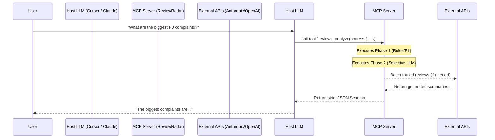
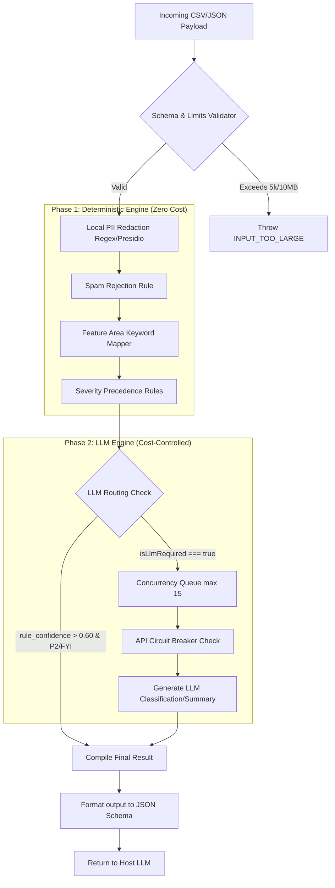

# System Architecture: ReviewRadar MCP

This document maps out the data flow and system boundaries of the `v1.0` architecture.

## 1. High-Level MCP Context Boundary
The MCP server operates as an isolated background process. It communicates with host applications (like Cursor or Claude Desktop) entirely via standard I/O (`stdio`) using the JSON-RPC protocol defined by the MCP spec.

## 2. Review Processing Pipeline (Internal Flow)
When `reviews_analyze` or `reviews_summarize` is called, the data passes through our strict 2-Phase pipeline.

## 3. Deployment, State, and Storage

*   **Process State:** Request handling is stateless at the MCP protocol layer.
*   **Persistent Local Storage:** Vector index artifacts are persisted to `storage/vector_index.json` and `storage/metadata.json` when imports run. This allows search and diagnostics across process restarts.
*   **Operational Implication:** Deployments must provide writable disk for `storage/` and include cleanup/backup policy for local index files.
*   **Security Boundary:** Raw text entering Node.js memory is scrubbed before LLM calls. Logs should avoid raw review text and should use IDs/counts for diagnostics.
