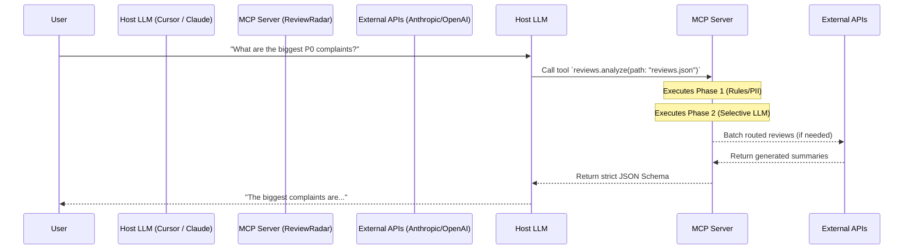
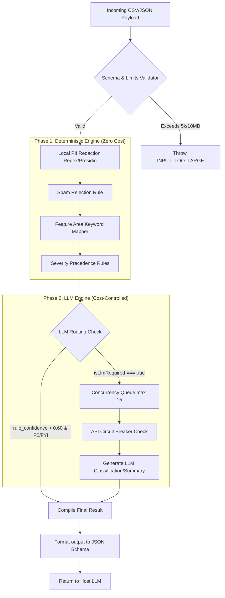

# System Architecture: Greenlight Review Intelligence MCP

This document maps out the data flow and system boundaries of the stateless `v1.0` architecture. 

## 1. High-Level MCP Context Boundary
The MCP server operates as an isolated, stateless background process. It communicates with host applications (like Cursor or Claude Desktop) entirely via standard I/O (`stdio`) using the JSON-RPC protocol defined by the MCP spec.

## 2. Review Processing Pipeline (Internal Flow)
When `reviews.analyze` or `reviews.summarize` is called, the data passes through our strict 2-Phase pipeline.

## 3. Deployment & State

*   **State:** The server holds **0 megabytes** of state between requests. All history, tracking, and comparison must be managed by the Host Client.
*   **Security:** Raw text entering Node.js memory is scrubbed at step `D`. By step `J` (where data leaves the local machine to hit OpenAI/Anthropic), it is guaranteed chemically clean of PII.
